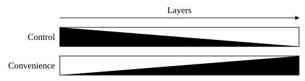

# About these guidelines {#sec-about .unnumbered}

These guidelines are for research software: all code written for a research
purpose, in academia or in industry, from the script a PhD student writes for
one analysis to the library or workflow that a community or a company relies
on. They are independent of programming language and scientific field.

Research software stands on a ladder, from code that only its author runs to
software that others build on and base publications and decisions on. Most
software starts at the bottom, and much of it should stay there. The principles
in these guidelines are what it takes to climb. Usually the science is known;
the task is to make it reliable, automated, and fit to run at scale.

How to test research software is the subject of a separate document,
, and how to document it the subject of another,
. The three form one set of guidelines: the other two use
the ladder, the normative language, and the terminology defined here, and their
rules carry the same weight. Each rule is stated in only one of the three
documents, and each cites the principles of the others by their title. A fourth
document, , states no rules: it defines the terms of testing
for all of them, such as oracle, unit test, and snapshot test, and describes
what each type of test catches and what it misses.

## Ladder of Research Software {#sec-ladder .unnumbered}

Research software stands on one of four rungs (@tbl-ladder). Which one depends
on the role of the software: how many people use it, how often and for how
long, on how much data, and what a wrong result would cost. The higher the
rung, the more depends on the software, and the more of these guidelines it has
to follow.

| Rung | Who uses it | Examples | What it takes |
|----------------|--------------------------|-----------------------------|-----------------------------|
| 1 Personal | Its author, for one analysis | The script a PhD student writes to try out an idea | Nothing yet; the principles already make the code easier to trust |
| 2 Shared | Its author again and again, or colleagues | A script passed around a group; a workflow that a lab reruns for every new batch of samples | Every *must*: the floor; the *should*s where they pay off |
| 3 Released | People its authors do not know and cannot support one by one | A published package; a workflow shared between institutions; a tool used across the departments of a company | The floor and, as a rule, the *should*s; documentation that users can work from alone; a stability commitment |
| 4 Infrastructure | Others who build on it or base decisions on it | A library that many packages depend on; a workflow that processes every sample of a core facility; software whose results enter a drug approval or an emission limit | The floor and, as a rule, the *should*s; testing and documentation as thorough as the cost of a wrong result demands; long stability commitments and controlled changes |

: The Ladder of Research Software. {#tbl-ladder}

The requirements marked *must* are the floor from the second rung on; most of
them cost little and prevent wrong results. What rises with each rung is
everything above the floor: how thoroughly the *should*s are followed, the
depth of testing and documentation, the effort put into performance, and the
length of the stability commitment (@sec-stable-api).

A high cost of a wrong result can put software on a higher rung than its number
of users suggests: a script that only its author runs, but whose numbers go
into a regulatory submission, is not personal software. When and how to climb
is the subject of @sec-role.

## Normative language {#sec-normative .unnumbered}

The guidelines distinguish requirements from defaults. The following words
carry a fixed meaning throughout, in the spirit of RFC\ 2119:

must, must not
:   A requirement for all software from the second rung of the 
    on. Code that violates it is a defect and is fixed, not justified.

should, should not
:   A strong default. A deviation is acceptable only for a concrete reason,
    which is stated where the deviation occurs, for example in a code comment
    or in the review. The rung of the software on the ladder is such a reason;
    it is stated once for the whole package, for example in its documentation,
    rather than at each deviation.

may
:   Permitted, but not required.

Plain imperatives such as "prefer" and "avoid" carry the weight of *should*.
When two rules pull in different directions, the priorities in @sec-quality
decide.

## Library code and workflow code {#sec-library .unnumbered}

The code of research software does one of two jobs, and the Hollywood principle
tells them apart: *don't call us, we'll call you*.

Library code is a collection of reusable building blocks, such as functions,
classes, and data types, that callers use in their own code. It does not decide
what happens or in which order: the caller owns the program and decides.
Library code should provide composable primitives that users call from their
own scripts, notebooks, workflows, and host-stack tools, and should not take
over the main program, the solver or simulation loop, the data model, or the
analysis workflow. Where the method needs code from the user, such as an
objective function, a model, or the right-hand side of a differential equation,
accept it as an ordinary function argument. Requiring users to subclass package
classes or to register code with a package-managed lifecycle turns library code
into a framework on top of the host stack.

::: {.definitionbox}
**Library code** is called and returns. Its caller decides how the work is
done, step by step: what runs, in which order, and what happens with each
result.
:::

Workflow code follows the Hollywood principle: it owns the program and calls
other code to do the work. A workflow is a defined sequence of steps that
carries out a task from start to finish. It encodes the order of the steps and
the inputs and outputs of each, and often branching, retries, parallel
execution, and scheduling.

Like library code, workflow code has a caller: a person, a machine, or a
program that starts it, usually by running a command, and receives its results.
That caller decides whether the workflow runs and with which inputs and
configuration, but not how. The caller may itself be workflow code, as when a
larger workflow runs a smaller one as one of its steps. Workflow definitions,
for example for Snakemake, Nextflow, or Make, and the scripts of their steps
are workflow code. So is the main function of a command-line tool, which reads
the arguments and the input, calls library code, and writes the output: each
command is a small workflow.

::: {.definitionbox}
**Workflow code** is called and takes control. Its caller decides only whether
it runs and with which inputs; the workflow code decides how: what runs, in
which order, and which other code does the work.
:::

In a kitchen, library code is the knives, the pans, and the techniques;
workflow code is the recipe, which says to chop this, then sauté that for five
minutes, then combine.

The scientific logic of a package should be library code, where it can be
tested, reused, and scaled without running the whole workflow. Workflow code
may contain a piece of science while that piece is short, used in only one
place, and tested by running the workflow code on a small input
(@sec-end-to-end). The piece should move into library code once a second step
or code outside the workflow needs it (@sec-dry), once it needs tests of its
own, or once it grows beyond what a reader can check at a glance. Wherever the
science lives, the rules about the science apply to it.

Workflow code owns its program, and with it the program's output, files, and
process. Rules that restrict library code, such as those on printing, files,
and global state, therefore do not apply to it.

The principles are grouped accordingly. @part-general applies to all code;
where a principle works differently for the two kinds of code, it says how.
@part-workflow adds the principles that apply only to workflow code, and
@part-library those that apply only to library code. @part-other describes
other forms of research software, such as graphical applications and notebooks,
and what each gains and loses compared with library and workflow code.

## Packages {#sec-package .unnumbered}

Library code and workflow code describe what code does. The package describes
how it is shipped.

::: {.definitionbox}
A **package** is the unit of distribution: what is installed, versioned, and
shared. It may contain library code, workflow code, or both, and it is not a
synonym for a library.
:::

Mixing the two kinds of code is common. A package may offer library functions
for users who want fine control together with a command that chains them into a
standard analysis, or ship workflow definitions as files next to its library
code. A command-line tool that does one job, such as sorting sequence
alignments or regridding a climate field, is therefore library code behind a
thin layer of workflow code, while a tool that runs a whole analysis by calling
other tools in a fixed order is a workflow, even when it is started like any
other command.

When a package contains both, workflow code calls library code, never the other
way round. Library code should not depend on the workflow code of its package
(@sec-modules), so that users can reuse the building blocks in their own
workflows without being forced into the package's own.

## Terminology {#sec-terminology .unnumbered}

Package
:   The unit of distribution: what is installed, versioned, and shared
    ().

Library code
:   Code that is called and returns ().

Workflow code
:   Code that is called and takes control ().

Host stack
:   The software ecosystem the user already works in: the programming language,
    its standard array and data-frame types, its established numerical,
    statistical, and plotting libraries, and the user's own workflow tools.
    Examples are the scientific Python ecosystem, R with its package
    repositories, and Julia with its package ecosystem. The host stack sets the
    conventions for data types, randomness, warnings, logging, and packaging
    that the package follows.

Entry point
:   Anything a caller invokes to hand inputs to the package and get a result: a
    user-facing function, a command of a command-line tool, a workflow, or a
    step of a workflow.

User-facing function
:   Any function, class, or method that is documented for users, including
    low-level primitives. Together, the user-facing functions form the public
    API; everything else is internal.

Caller
:   The person, machine, or code that calls an entry point.

The terms of testing, such as test, test suite, oracle, and the types of tests,
are defined in [*Types of Research Software
Tests*](test-types.qmd#sec-terminology).

<!-- The checklist starts on a page of its own, so that it can be printed. -->



# At a glance {#sec-at-a-glance .unnumbered}

Every principle of these guidelines in one line. The number and the title link
to the principle. @part-other describes other code forms and states no
principles of its own.

::: {.glance}
| No. | Principle | Rule |
|-----|------------------------------|----------------------------------------------------|
| **@part-general** | **** | |
| **[-@sec-priorities]** | **** | |
| [-@sec-right-thing] |  | Make sure the approach is right before investing in optimization, testing, or polish. |
| [-@sec-quality] |  | When goals conflict, correctness wins, then clarity, testability, maintainability, performance, and features. |
| [-@sec-loud] |  | Fail visibly rather than return a result that looks valid but cannot be trusted. |
| [-@sec-role] |  | Invest what the rung of the software on the ladder demands, and climb before new users rely on it. |
| [-@sec-kiss] |  | Prefer the design with the fewest concepts, options, and special cases that solves the problem well. |
| **[-@sec-scope]** | **** | |
| [-@sec-core-domain] |  | Write custom code only for the distinctive scientific problem, and reuse mature libraries for the rest. |
| [-@sec-sustainability] |  | Judge every feature and dependency by what it costs over the lifetime of the software. |
| **[-@sec-abstraction]** | **** | |
| [-@sec-applications] |  | Build for concrete applications that someone wants to run, and keep them as runnable examples or tests. |
| [-@sec-dry] |  | Give every piece of knowledge, such as a constant, a rule, or a convention, one authoritative definition. |
| [-@sec-magic-numbers] |  | Name, define once, and justify every constant with a scientific or numerical role. |
| [-@sec-wrong-abstraction] |  | Unify similar code only when it encodes the same rule. |
| [-@sec-modules] |  | Give each function, module, and step one job, and let them depend on each other only through their interfaces. |
| [-@sec-substitution] |  | Anything that stands in for something else, such as a subclass, a backend, or a replaced tool, must keep its whole contract. |
| **[-@sec-api]** | **** | |
| [-@sec-api-first] |  | Write the code the user would write before the code that makes it work. |
| [-@sec-conventions] |  | State axis order, units, and conventions explicitly, and keep identifiers aligned with the data. |
| [-@sec-numeric-defaults] |  | Treat a change of a numerical default as a breaking change. |
| [-@sec-stable-api] |  | Keep the public API small, number releases by compatibility, and deprecate before removing. |
| [-@sec-document-method] |  | Document the algorithm, its assumptions, defaults, and references, and every difference from them, not the structure of the code. |
| **[-@sec-explicit-behavior]** | **** | |
| [-@sec-explicit] |  | Do what the name and the arguments say, and nothing more. |
| [-@sec-no-guess] |  | Never infer the user's intent from the data; make the user choose. |
| [-@sec-mutation] |  | Leave the caller's data untouched, unless the user opts into an in-place operation. |
| **[-@sec-errors]** | **** | |
| [-@sec-output] |  | Raise for invalid calls, warn for probable mistakes, and otherwise stay silent. |
| [-@sec-validation] |  | Validate inputs at the point of entry, with errors that say how to fix the call. |
| [-@sec-missing] |  | Document a policy for missing values at every entry point, and never impute or drop them silently. |
| [-@sec-assertions] |  | Assert the key invariants of a method in the code, on every run. |
| **[-@sec-numerics]** | **** | |
| [-@sec-stability] |  | Choose formulations that stay accurate over the whole input range. |
| [-@sec-convergence] |  | Report ill-conditioned problems, and never return an unconverged result as if it had converged. |
| **[-@sec-testing-reproducibility]** | **** | |
| [-@sec-testing] |  | Test every entry point, and pass the full test suite before every release. |
| [-@sec-size-matters] |  | Document the complexity of every entry point, and benchmark at the sizes of real applications. |
| [-@sec-reproducibility] |  | Make results reproducible within a stated tolerance, with randomness that the caller controls. |
| [-@sec-traceability] |  | Expose the version, archive every release, and record the version and the parameters with every result. |
| [-@sec-recipe] |  | Keep the code that produced every artifact, such as a figure or a table, and treat what is edited by hand as source. |
| **@part-workflow** | **** | |
| **[-@sec-steps]** | **** | |
| [-@sec-declared-inputs] |  | Declare to the workflow manager everything the outputs of a step depend on. |
| [-@sec-hand-off] |  | Pass data between steps without losing values, precision, missing values, units, or identifiers. |
| [-@sec-all-or-nothing] |  | A step writes all of its outputs, or fails and leaves none that look complete. |
| **[-@sec-environments]** | **** | |
| [-@sec-pin] |  | Run every step in an environment whose versions are pinned exactly. |
| [-@sec-end-to-end] |  | Run the whole workflow on a small dataset on every change, and check its outputs. |
| **@part-library** | **** | |
| **[-@sec-library-structure]** | **** | |
| [-@sec-functions] |  | Put library code in functions and classes; at module level, only imports, constants, and definitions. |
| [-@sec-plotting] |  | Keep plotting out of computation, in separate functions with an optional dependency. |
| **[-@sec-interfaces]** | **** | |
| [-@sec-no-files] |  | Take and return data objects, and leave reading and writing files to the caller. |
| [-@sec-layers] |  | Offer the API in layers, each built from the public primitives of the layer below. |
| [-@sec-follow-types] |  | Keep the type, precision, and placement of the caller's data. |
| [-@sec-validation-cost] |  | Always run cheap metadata checks; run data checks by default, with an explicit way to turn them off. |
| **[-@sec-side-effects]** | **** | |
| [-@sec-global-state] |  | Never change process-wide settings, such as the global random generator or the number of threads. |
| [-@sec-cost] |  | Never densify, materialize, download, or move data as a hidden side effect. |
| [-@sec-import] |  | Keep loading the package cheap and silent. |
:::

# All code {#part-general .part}

# Guiding priorities {#sec-priorities}

## Build the right thing before building the thing right {#sec-right-thing}

Establish that the overall approach is correct before investing in
optimization, testing, documentation, or polish. Effort spent in the wrong
direction is not partially recovered; it is lost in full, and the better the
execution, the greater the loss.

Incremental improvement converges on the nearest local optimum, not on the best
achievable one. A design can therefore become steadily better while remaining
fundamentally misplaced, and no amount of further refinement will reveal this,
because refinement measures progress against the current approach rather than
against the alternatives to it.

Quality and speed multiply direction rather than substitute for it. Executing a
wrong approach quickly and well only arrives sooner at a place that must be
abandoned. Refinement also entrenches: the more effort a design has absorbed,
the harder it becomes to question, so the assessment should happen early and be
repeated deliberately.

Identify which decisions are reversible and which are not. Reversible decisions
can be made quickly and corrected later. Irreversible decisions, such as the
core abstraction and the public interface, deserve the effort that would
otherwise be spent perfecting details, because they determine whether that
effort is worth anything at all.

## Get your priorities right {#sec-quality}

When goals conflict, rank them as follows, and let the higher one win:

1. **Correctness.** The results are right and reproducible; a result that
   cannot be reproduced cannot be checked (@sec-reproducibility).
2. **Clarity.** Code, interface, and behavior can be understood. Code that
   cannot be understood hides its errors.
3. **Testability.** Correctness can be demonstrated, not merely claimed.
4. **Maintainability.** The package stays correct and clear as it changes.
5. **Performance.** The package is fast enough for the data sizes of real
   applications (@sec-size-matters).
6. **Features.** More functionality, options, and code are a bonus, never a
   substitute for the priorities above.

The same ranking resolves conflicts between the rules in these guidelines: when
two rules pull in different directions, the rule that serves the higher
priority wins. Prefer a small amount of reliable functionality over a large
amount of unreliable functionality; code that is produced quickly but is hard
to understand, test, or trust only adds to the burden of the package.

## Better loud than wrong {#sec-loud}

When something goes wrong, the package must fail visibly rather than return a
result that looks valid but cannot be trusted. Given the choice between an
error and a result that may be wrong, choose the error.

The two outcomes are not symmetric. A failure is annoying and can cost time,
but it is visible and its cost is bounded: the user sees it, fixes the cause,
and runs again. A silently wrong result looks exactly like a correct one. It
flows into further analyses, figures, publications, and decisions, and nobody
looks for the error, because nothing suggests that there is one. A failure
costs convenience; a silently wrong result costs correctness, which ranks first
(@sec-quality).

Silent failures are rarely designed. They usually arise from code that tries to
be helpful or robust. Typical sources are:

- Catching an error and returning a default value, an empty result, or NaN in
  place of the result.
- Falling back to a different algorithm, approximation, or data source when the
  intended one fails or an optional dependency is missing.
- Letting integers overflow, clipping or truncating values to fit a type or
  range, or broadcasting arrays whose shapes do not match.
- Dropping records that find no match in a join or alignment.
- Continuing after a step has failed, so that an incomplete output looks
  complete.

Each of these turns a failure the user would have seen into a wrong result the
user will not see. Let errors that cannot be handled correctly propagate, and
make every fallback, coercion, and omission explicit.

Being loud does not mean giving up at the first problem. A workflow that
processes thousands of samples may skip one that fails, and an iterative method
may return a result that did not converge (@sec-convergence), provided the
degradation is explicit: it is documented or chosen by the caller, the result
records what is missing or uncertain, and the failure is reported through the
channels of @sec-output. Workflow code that did not complete what was asked
must also say so in its exit status (@sec-all-or-nothing). What must never
happen is a degraded result that cannot be told apart from a valid one.

Many rules in these guidelines apply this principle to a particular situation.
Where none of them covers a case, the default is the same: when in doubt, fail.

## Pay as you grow {#sec-role}

Engineering effort has to pay for itself, and not all research software
deserves the same investment. Invest what the rung of the software on the
 demands. Building for a higher rung takes effort away from the
science; building for a lower one is paid for in wrong results.

Software usually climbs without anyone deciding it, and the first step is the
one most often missed: the script that a colleague asks for is already on the
second rung. Reassess the role whenever the users, the data, or the stakes
change, and climb before new users rely on the software, not after the first
wrong result. Not every script needs to climb, and one that stays on the first
rung is not a failure.

## KISS: Keep it simple, stupid {#sec-kiss}

Prefer the simplest design that solves the problem well. Simplicity is measured
by how much a reader has to hold in mind to understand the code and its
behavior: the number of concepts, options, code paths, and special cases, not
the number of lines.

Every option multiplies the behaviors that have to be documented and tested,
because options interact. Every layer of indirection is a place where a reader
has to stop and look elsewhere. Add either only when a concrete application
demands it (@sec-applications).

Prefer plain, direct code over clever code. When two designs solve the problem
equally well, choose the one with fewer concepts. Simple does not mean
simplistic: a design that looks simple because it ignores part of the problem,
such as missing values or edge cases, is not simple but incomplete.

# Scope {#sec-scope}

## Own only the core domain {#sec-core-domain}

Custom code belongs only in the distinctive scientific problem that justifies
the package. That problem is the core domain. Linear algebra, optimization,
numerical integration, automatic differentiation, parallel execution, file
input and output, and plotting are generic capabilities: reuse mature libraries
and tools from the host stack instead of rebuilding them.

A package must document, test, and maintain everything it owns. Owning generic
work therefore takes effort away from the scientific contribution, and a
reimplementation is usually less tested, less optimized, and less numerically
robust than the established one. Implement the core; compose with the host
stack for the rest.

## Code is for life, not just for Christmas {#sec-sustainability}

Everything the package takes on is a commitment for the lifetime of the
software, and that lifetime usually exceeds the involvement of the people who
wrote it. Removing something later breaks the users who rely on it
(@sec-stable-api). Judge each addition by what it will cost to maintain over
years, not by the effort of adding it today, and prefer established,
well-understood technology over the newest option.

**Features.** Every feature adds to what the package must document, test, and
maintain (@sec-core-domain) for as long as it lives. Prefer a smaller package
with well-tested core functionality over a larger one with many unfinished or
poorly supported features.

**Dependencies.** Each dependency is code the package did not write but still
has to install, pin, test against, license, and debug. Prefer the host stack
the user already has, and add a dependency only when it owns a job the package
must not reimplement and cannot leave to the caller. Choose dependencies that
will outlive your own project: widely used, maintained by more than one person,
backed by an institution or an active community, and with a history of regular,
compatible releases. Avoid dependencies that rest on a single maintainer,
thesis, or grant; where a fragile one is unavoidable, isolate it behind a thin
internal interface so that it can be replaced. Dependencies needed only for
optional functionality, such as plotting, should be optional, so that the core
installs without them.

**The package itself.** Build it to survive its authors. No part of the code
should be understood by only one person, and the knowledge needed to maintain
it, such as design decisions, conventions, and the release process, belongs in
the repository, not in people's heads ().

# Code structure and abstraction {#sec-abstraction}

## Derive abstractions from applications, not applications from abstractions {#sec-applications}

Build for concrete applications that someone actually wants to run. An
abstraction invented first, in the hope that useful applications will follow
from it, is a guess about demand, and such guesses fail in ways that become
visible only once real work is attempted.

Generality that no application requested is speculative generality. It adds
options, layers, and special cases that must be documented, tested, and
maintained forever while solving no problem anyone has. The cost is paid
immediately, the benefit remains hypothetical.

Several genuinely different use cases are usually required before the shared
concept becomes visible; the rule of three sets the customary threshold at
three. A single use case invites a design fitted too tightly to it, and no use
case invites a design fitted to nothing.

Keep the driving applications in the repository as runnable examples or
integration tests. They document intent, they fail when the design drifts away
from practice, and they force every proposed feature to name the concrete task
that justifies it. Software is a practical artifact and can only be judged in
use.

## DRY: Don't repeat yourself {#sec-dry}

Every piece of knowledge should have a single, authoritative representation in
the software. DRY is not primarily about code. Knowledge includes rules,
assumptions, constants, numerical defaults, conventions such as axes and units,
validation logic, data schemas, and the documentation that describes them.

When the same knowledge lives in several places, every change has to find and
update all copies consistently. Copies that drift apart produce software that
contradicts itself. Typical examples in scientific code are a tolerance
hard-coded in several functions, the same input check reimplemented in each
user-facing function, a default value repeated in the function signature, its
documentation, and the examples, or a threshold set both in the configuration
of a workflow and in the script of one of its steps. Define such knowledge once
and refer to it everywhere else. Where documentation has to state a value,
generate it from the single definition if the tooling permits.

DRY concerns knowledge, not text. Code that looks different can still duplicate
the same rule. Conversely, code that looks alike may encode different rules,
and merging it is a mistake (see @sec-wrong-abstraction).

## No magic numbers {#sec-magic-numbers}

Every numerical constant with a scientific or numerical role, such as a
threshold, cutoff, tolerance, iteration limit, or physical constant, must have
a name, a unit where it has one (@sec-conventions), a single definition
(@sec-dry), and a justification stated next to that definition: a reference, a
derivation, or the reason for the choice. In scientific code, an unexplained
`3.0` or `0.05` is often an unexamined modeling decision, and a reviewer cannot
tell a deliberate choice from an arbitrary one.

If a constant affects the results and users might reasonably want a different
value, expose it as a parameter; its default then becomes part of the API
(@sec-numeric-defaults). Take physical constants from an authoritative source
in the host stack rather than typing them in by hand. Constants whose meaning
is evident from the code, such as the 2 in $2\pi$, need no name.

## Duplicate code is cheaper than the wrong abstraction {#sec-wrong-abstraction}

Avoid premature abstraction. Similar-looking code should be unified only when
it represents the same underlying concept or rule (@sec-dry). A wrong
abstraction hides important differences, increases complexity, and makes future
changes harder, because every change has to respect all of its callers at once.
Prefer simple duplication until the shared idea is clear and stable.

A common sign of a wrong abstraction is a shared function that accumulates
flags and parameters whose only purpose is to switch its behavior for
particular callers. When that happens, inline the function back into its
callers, remove from each copy what that caller does not need, and extract a
new abstraction only once the genuinely shared rule has become visible.

## Low coupling, high cohesion {#sec-modules}

Keep together what changes together, and keep apart what changes independently.
Each function, class, module, and workflow step should have one job, and the
parts should depend on each other only through their interfaces: arguments,
return values, documented behavior, and declared files. A change to one part
then stays in that part.

Coupling as such cannot be avoided, and some of it is wanted: parts that use
the same knowledge should depend on its single definition (@sec-dry), while
parts that merely look alike should not be tied together by a shared
abstraction (@sec-wrong-abstraction). What has to be avoided is hidden
coupling. Coupling through an interface breaks loudly: when a signature
changes, its callers fail. Hidden coupling breaks silently. A function that
relies on another to return its rows sorted, or on a module-level variable that
a third one sets, keeps running after that behavior changes and returns a
plausible wrong number (@sec-loud).

Depend only on what another part promises, not on what it happens to do. Row
order, whether a result is a copy or a view, and the position of a value in a
returned tuple are part of the contract only if they are documented; if a
caller needs them, document them and test them. Pass data through arguments and
return values rather than through state that several parts read and write
(Subsections [-@sec-mutation] and [-@sec-global-state]). A part that depends
only on its inputs can also be tested on its own. Pass a function the values it
uses, not the whole configuration from which it reads two of them: its
signature then shows what its result depends on, and a test does not have to
build a complete configuration.

High cohesion is the other half, and the single responsibility principle states
it for classes and modules: each should have one reason to change. A part with
one job can be named for it, and understood, tested, and replaced on its own. A
part with several jobs couples them, because a change to one risks the others,
and a part that cannot be named precisely usually has no single job.

**Library code.** Each module should own one part of the package, such as
validation, computation, preprocessing, or visualization, and its name should
say which. Avoid miscellaneous helper modules such as `utils` when a more
specific name would describe the purpose of the code. Dependencies between
modules should point in one direction, from the specific to the fundamental.
Computation must not depend on visualization, and core computation should not
depend on input and output. Knowledge shared by several modules, such as
validation checks and numerical defaults, belongs in one module that the others
import (@sec-dry).

**Workflow code.** Each step should do one job, such as aligning reads or
regridding a field, so that it can be rerun, replaced, and checked on its own.
Steps depend on each other only through the files and parameters they declare,
as @sec-declared-inputs requires, and every file passed between them is an
interface (@sec-hand-off). A step that reads the temporary files of another, or
relies on the order in which independent steps happen to run, is coupled to it
in a way the workflow manager cannot see.

## Liskov substitution: a stand-in keeps every promise {#sec-substitution}

Anything that stands in for something else must keep the documented contract of
what it stands in for: every operation that it supports must mean what it means
for the original. A stand-in is a subclass, a type that implements an interface
of the host stack, such as its array or data frame interface, a backend that
runs the same method on other hardware, or a tool or workflow step that
replaces another.

A broken contract rarely shows. The code written for the original runs on the
stand-in unchanged and returns a plausible wrong number (@sec-loud), and nobody
notices, because not noticing was the point of the substitution. In Python,
`numpy.matrix` is a subclass of the array type, but `*` multiplies matrices
instead of elements, so code written for arrays computes something else; this
is one reason its use is discouraged. In R, a tibble is a `data.frame`, but
`df[, 1]` returns a tibble of one column rather than a vector, so code that
asks for the length of the column gets 1 instead of the number of rows. The
contract includes the numerical behavior: the type and precision of results,
the treatment of missing values (@sec-missing), axis order and units
(@sec-conventions), sign and normalization conventions, and the defaults
(@sec-numeric-defaults).

This is the other side of @sec-modules: a caller should depend only on what
another part promises, and a stand-in must keep all of it. @sec-explicit holds
an entry point to its name; this principle holds a stand-in to the type it
claims to be. Where a stand-in cannot keep the meaning of an operation, it
should raise an error for it rather than do something else. The strict form of
the principle forbids this too, but an error narrows the claim where the caller
sees it (@sec-loud), while a different result breaks it where nobody does. A
stand-in that cannot keep most of the contract should not make the claim at
all.

**Library code.** Prefer wrapping a type that the package does not own, such as
an array or data frame type of the host stack, to inheriting from it. A class
that holds an array promises only the operations it defines; a subclass
promises every operation of its parent, including those the parent gains in
later releases. A backend that the caller selects to run the same method, such
as on an accelerator, is a stand-in for the default one: it may round
differently, by an amount the documentation states, but it must compute the
same quantity. A different method selected by an option is not a stand-in; it
is documented as a method of its own (@sec-document-method).

**Workflow code.** Replacing a tool or a step makes the new one a stand-in for
the old one, whether or not its authors claim it, because the steps that read
its files keep assuming the old meaning. A valid format is not enough
(@sec-hand-off). Two read aligners, such as BWA and Bowtie\ 2, both write valid
BAM files, but they score mapping quality on different scales, so a later step
that keeps reads with a mapping quality of at least 30 keeps a different set of
reads after the swap. Before replacing a tool, check every value that later
steps read for a change of meaning, such as a quality score, whether
coordinates start at 0 or 1, or a normalization, and adapt those steps where it
changed.

# API design {#sec-api}

## Write the API first {#sec-api-first}

Write the code the user would write before writing the code that makes it work.
The calling code is the part that must be good, because it is the part users
see, learn, and depend on. Everything behind the interface can be rewritten
later; the interface itself cannot. For workflow code, the calling code is the
command, the configuration, and the table of samples or inputs that users
write.

Designing outward from the implementation produces signatures that expose
internal structure rather than user intent. Designing inward from the call site
produces the opposite, and reveals awkwardness while it is still free to fix.

Judge a proposed interface by reading realistic usage rather than the
definition. Argument order, naming, and defaults that appear reasonable in a
signature often read badly in the script that calls them, and that script is
the true specification.

An interface that cannot be written cleanly is a signal that the underlying
concept is not yet clear. Resolve that before implementing, since
implementation effort tends to entrench whatever interface it was built to
serve.

## Name axes, units, and conventions {#sec-conventions}

Axis order, such as observations-by-variables versus variables-by-observations
or time-major versus space-major, the index base, coordinate systems and
reference frames, angle conventions, and physical units are part of the meaning
of every array. If they are not in the signature, the documentation, the
returned object, or the file that holds the data, users will infer them
wrongly. The package must not infer them from the data either (@sec-no-guess).

Do not rely on a comment or an example notebook to carry a convention. Name the
axes, state the units, and prefer the labeled data structures of the host stack
where they exist. Keep identifiers the caller supplied, such as sample IDs,
gene names, station codes, or node labels, intact and aligned with the data
through every operation.

## Numerics and defaults are part of the API {#sec-numeric-defaults}

Changing a default normalization, initialization, regularization strength,
convergence tolerance, iteration limit, $\varepsilon$, reduction, or
tie-breaking rule can change published numbers. Such changes must be treated as
breaking changes of the API, not as internal tweaks. This holds for the
defaults of functions, of command-line options, and of workflow configurations
alike.

Signatures are not the whole contract. Documented numerical defaults are part
of the scientific behavior of the package. If a default has to change, follow
the process for breaking changes in @sec-stable-api.

## Design stable APIs {#sec-stable-api}

API stability builds user trust, and in science it protects published results.
Avoid breaking changes that are not necessary. Keep the public API small, since
everything public is a commitment, and mark internal code as private using the
host stack's convention. The public API of workflow code is what its users
write and read: its command-line options, the keys and defaults of its
configuration, the formats of its inputs, and the names and layout of its
outputs.

Number releases so that the version communicates compatibility, for example
with semantic versioning, and record every change of behavior in a changelog
(). Changes of numerical behavior, including
changes of defaults (@sec-numeric-defaults), must be listed explicitly in the
changelog, not summarized as fixes.

When a breaking change is necessary, deprecate before removing: emit a
deprecation warning (@sec-output) that names the replacement, keep the old
behavior available for a stated period, and document the migration path.

## Document the method, not the implementation {#sec-document-method}

Documentation should describe what a function computes and how to use it, not
how the code is organized internally. Clear interfaces allow the implementation
to change without breaking user code.

In research software, however, the method is part of the behavior. The
documentation of a user-facing function, a command, or a workflow should state
the algorithm or estimator, the approximations and assumptions it makes, its
numerical defaults, its policy for missing values (@sec-missing), and
references to the literature that defines the method, with every difference
between the implementation and that literature; for a workflow, it also names
the method and the tool that each step uses. Users need this knowledge to
interpret and report their results.

Implementation details, such as loop structure, internal data structures, and
private helper functions, do not belong in user documentation. The dividing
line is whether a change could alter a scientific result: if it could, it is
part of the method and must be documented; if it could not, it is
implementation. How documentation is organized, written, and kept true as the
code changes is the subject of .

# Explicit behavior {#sec-explicit-behavior}

## Do what it says on the tin {#sec-explicit}

An entry point should do what its name and arguments say, and nothing more.
Operations that change the data, such as filtering, normalization, sorting,
deduplication, or outlier removal, must not be hidden inside an entry point
named for a different operation: a user who calls a fitting function should not
discover later that the data were also filtered, and a workflow step named for
alignment should not also discard reads. Expose such operations as named
arguments or configuration options, or provide them as separate functions or
steps. Operations that are part of the definition of the method are documented
as such (@sec-document-method).

This is the counterpart of @sec-no-guess: an entry point must neither read more
into a call than it states nor do more than it asks.

## Don't guess {#sec-no-guess}

The package must not resolve an ambiguity in the user's intent on the user's
behalf. A default is not a guess: it is fixed, documented, and independent of
the data. A guess applies heuristics to the data to decide what the call means,
such as transposing a matrix because of its shape, detecting whether data are
already normalized, inferring units or date formats from the values, matching
labels approximately, or repairing malformed input. If such an interpretation
could change the result, the user has to decide: it is a scientific choice, and
it belongs to the user. A guess also makes the meaning of a call depend on the
data, so the same code can do different things for different datasets. When the
guess is wrong, the result is wrong without looking wrong (@sec-loud).

Make the user state the choice through an argument or a configuration option,
or raise an error that lists the possible interpretations. Where automatic
selection is genuinely useful, offer it as an explicit option, such as a
`method` argument with the value `auto`, and record the choice with the result.
Heuristics may trigger warnings (@sec-output), but must not change behavior:
announcing a guess does not make it the user's choice.

## Do not mutate caller data {#sec-mutation}

An entry point must not overwrite, transpose, densify, drop missing values
from, or otherwise rewrite data the caller still holds, unless the user opted
into an explicit in-place operation, such as a clearly named in-place function
or argument. Silent mutation makes it impossible to know which object or file
still holds the original data.

If a transformation is required, library code returns a new object, and
workflow code writes a new file; a step must not modify, overwrite, or delete
its input files. The default is: leave caller data untouched.

# Input validation and errors {#sec-errors}

## Raise, warn, or stay silent {#sec-output}

Code communicates with its caller through three channels, and each situation
calls for exactly one of them:

- **Raise** when the call is invalid, or when continuing would return an
  untrustworthy result as if it were valid. The user has to act, and execution
  must not continue as if nothing happened.
- **Warn** when the call is valid but is probably not what the user intended,
  for example when a heuristic suggests that the data are not what the call
  assumes (@sec-no-guess), or when the behavior of the call will change in a
  future version. Deprecations (@sec-stable-api) belong here.
- **Stay silent** when the call is valid and unremarkable.

A warning must not replace an error: if continuing would produce a wrong
result, raise (@sec-loud). Warnings should name the argument or condition that
triggered them and say how to avoid them by changing the call. Avoid emitting
the same warning repeatedly, for example inside a loop.

**Library code** raises and warns through the host stack's standard mechanisms
for errors and warnings, so that users can catch errors, filter warnings, or
turn them into errors. It must not print: standard output belongs to the user's
scripts, notebooks, and batch jobs. Progress reports and diagnostic messages
fall outside the three channels. They should be opt-in, through an explicit
argument or the host stack's standard logging or messaging facility, so that
the user decides whether and where they appear.

**Workflow code** raises by stopping with an error exit status and a message on
the standard error stream (@sec-all-or-nothing), and warns on the standard
error stream or in its log. Messages must not go to standard output where it
carries data, because they would end up in the data.

## Garbage in, useful error out {#sec-validation}

User-facing functions, commands, and workflows must validate their inputs at
the point of entry: types, shapes, bounds, units where they are declared, and
the semantic constraints of the method. Invalid inputs, unsupported
combinations of arguments, and dangerous settings must produce an error at the
boundary, not a numerical failure or a wrong result further downstream. Fail
loudly and early (@sec-loud). A workflow should check its configuration and its
table of inputs before its first step runs, so that a typo fails within
seconds, not after hours of computation.

Error messages should be specific enough that users can recover without
searching through the full documentation: name the argument, state what was
expected and what was received, and where possible say how to fix the call.

Do not rely on documentation for correctness. Many users read documentation
only partially, skim examples, or rely on auto-completion and error messages
while using the package. Documentation explains correct usage; the code must
enforce the constraints that correctness depends on. Make misuse difficult and
failures obvious.

Implement each check once, in the validation module (@sec-modules), and call it
from every entry point that needs it (@sec-dry). Private functions that are
reached only through a validated entry point should not repeat the checks.

## Mind the gap, don't fill it {#sec-missing}

Each entry point must have a documented policy for missing values, such as NaN,
NA, or masked entries: reject, propagate, or mask. Silent imputation, dropping,
or filling is a scientific bug, not a convenience (@sec-loud): it replaces a
missing measurement with a guess (@sec-no-guess).

If the input violates the policy, the entry point must raise an error that
names the missing values, rather than fail later with an unrelated numerical
error. Checking for missing values is a data check in the sense of
@sec-validation-cost.

## Wear belt and braces {#sec-assertions}

Tests check the package on the inputs someone thought of, but real data reach
paths that no test exercised. A bug that produces a silently wrong result is
the worst failure research software can have, so the key invariants of a method
should also be checked in the code itself, on every run. Such assertions
complement the tests; they do not replace them.

Assert what must hold if the code is correct and whose violation would
otherwise go unnoticed, such as a normalization, a conservation law, or the
alignment of identifiers after a reordering. These are often the same
invariants the tests check (). Keep assertions
cheap (@sec-cost), and do not assert what holds by construction or what
validation already guarantees; mistakes of the caller belong to validation
(@sec-validation).

A failed assertion means the package has a bug, so an assertion should fail on
nothing else. An assertion on a floating-point invariant should have a
tolerance that holds for every valid input, including ill-conditioned ones: an
error that the conditioning of the problem explains is not a bug, and it is
reported as @sec-convergence requires, not asserted. A mistake of the caller
that reaches an assertion is a bug too, in the validation, unless the caller
has turned off the data checks that would have caught it
(@sec-validation-cost).

A failed assertion must raise, never warn. Its message should say that the
package has a bug and ask for a report, rather than tell the user to change the
call; when the caller has turned off data checks, it should also name them as a
possible cause. Assertions must run in every configuration; where the assertion
mechanism of the host stack can be disabled, raise explicitly instead.

# Numerical correctness {#sec-numerics}

## Prefer numerically stable formulations {#sec-stability}

A formula that is correct in exact arithmetic can be badly wrong in floating
point. Choose formulations that remain accurate for the whole range of inputs
the package accepts, not only for well-behaved test data. Common patterns
include:

- Avoid subtracting nearly equal quantities, which cancels significant digits.
  Rearrange the formula, or use dedicated functions such as `log1p`, `expm1`,
  and `hypot`.
- Work in log space for products of many small numbers, such as likelihoods,
  and compute $\log\sum_i e^{x_i}$ as $m + \log\sum_i e^{x_i - m}$ with
  $m = \max_i x_i$.
- Solve linear systems instead of forming explicit matrix inverses, and prefer
  factorizations suited to the structure of the problem.
- Accumulate long sums with care, for example by pairwise or compensated
  summation, or with a higher-precision accumulator (@sec-follow-types).

Reuse the stable routines of mature libraries rather than reimplementing them
(@sec-core-domain). Test behavior at the boundaries of the input range, such as
very small and very large magnitudes and nearly singular inputs
().

## Report conditioning and convergence {#sec-convergence}

Distinguish an unstable algorithm from an ill-conditioned problem. An unstable
algorithm is a defect of the package and must be fixed. An ill-conditioned
problem cannot be solved accurately by any algorithm; the package cannot fix
it, but it must not hide it. Where conditioning can be estimated at reasonable
cost, check it and report an ill-conditioned problem through the channels of
@sec-output.

Iterative methods must not return a result that did not converge as if it had
(@sec-loud). When the iteration limit is reached or the convergence criterion
fails, either raise, or return a result that carries an explicit convergence
status and warn. Each iterative function must document which of the two it
does, and its result should record diagnostics such as the number of iterations
and the final residual.

# Testing and reproducibility {#sec-testing-reproducibility}

## Testing is not optional {#sec-testing}

Scientific code is particularly prone to subtle errors that produce plausible
but wrong numbers. Every entry point must have tests, and every release must
pass the full test suite. The steps of a workflow are tested by running the
whole workflow on a small dataset (@sec-end-to-end). Passing tests show
correctness only as far as their expected values are right; where these come
from, and how to write and maintain tests, is the subject of .

Tests should cover error paths as well as results: invalid inputs must be shown
to raise the documented errors (@sec-validation). Test the range of input types
the package claims to support, such as sparse, single-precision, or lazy data
(@sec-follow-types); a code path that is never exercised is not supported.

Run the test suite automatically on every change, across the versions of the
language and of the host-stack libraries that the package supports.

## Size matters {#sec-size-matters}

A method that works on test data but fails at the scale of real applications
solves no problem. Document the time and memory complexity of each entry point
in terms of the data size, and benchmark at the sizes of the driving
applications (@sec-applications), not only on toy inputs. Profile before
optimizing, since bottlenecks are rarely where intuition expects them, and
track benchmarks to catch performance regressions. Performance never outranks
correctness or clarity (@sec-quality).

## Once is luck, twice is science {#sec-reproducibility}

Results must be reproducible. In these guidelines, reproducibility means
obtaining the same scientific answer, within a stated tolerance, from the same
inputs, parameters, and package version, on a documented software and hardware
stack. It does not mean identical bits forever: floating-point results
legitimately vary across linear algebra libraries, processors, accelerators,
and compiler settings.

Randomness must be controllable by the caller. Where the host stack supports
it, every function that uses random numbers should accept a random number
generator or seed argument that controls all randomness within that call. Where
the host stack's convention is a single global generator, draw from the
generator the caller controls, subject to @sec-global-state. The behavior when
no generator or seed is supplied must be documented. Workflow code takes the
seed from its configuration, passes it to every step that uses random numbers,
and records it with the results (@sec-traceability).

Prefer deterministic algorithms. Where nondeterminism is unavoidable, for
example because parallel reductions sum in varying order, document it and
ensure that results still agree within the stated tolerance.

## Make every result traceable to a version {#sec-traceability}

A result is reproducible only if the exact software that produced it can be
identified and obtained again, whether the result ends up in a publication, a
report, or a decision.

The package must expose its version at run time through the host stack's
standard mechanism, such as `__version__` in Python or `packageVersion` in R,
and a command-line tool through a `--version` option. Every release should be
tagged in version control and archived so that the exact version can be
retrieved later: in a public archive with a persistent identifier, such as a
DOI, for published software, or in the organization's release archive for
internal software. Published software should also provide machine-readable
citation metadata, such as a `CITATION.cff` file, stating how to cite both the
software and the method ().

Results should record the package version and the parameters that produced
them, including defaults that were not set explicitly: library code records
them in the result objects it returns, and workflow code records them in the
outputs and run metadata it writes, together with the versions of the tools and
libraries it ran (@sec-pin). Changes of behavior between versions are traced
through the changelog (@sec-stable-api).

## Keep the recipe, not just the cake {#sec-recipe}

Every artifact should be kept together with its recipe, so that it can be made
again, and made differently. An artifact is anything that a package ships or a
result depends on that was produced rather than written, such as a figure in
the documentation, a table of precomputed constants, a processed dataset, a
mesh, a trained model, a container image, generated code, or a compiled binary.
Its recipe is the code that produced it, such as a script, a notebook, or a
build rule, together with the inputs that code read. If an artifact was
generated, keep its recipe. If it was edited by hand, it is source: keep it
under version control, in a format that can be edited, and never let a
generator overwrite it.

Reproducibility asks whether the same result can be obtained again
(@sec-reproducibility); this principle asks whether a different one can be made
when it is needed. The two are independent. A container image without the file
that built it, such as a Dockerfile or an Apptainer definition file, gives the
same results for as long as it runs and can never be changed; a Dockerfile that
installs whatever versions are current can be changed freely and reproduces
nothing (@sec-pin). In research software, the change that is needed is often a
correction. When a bug is fixed, every artifact it touched has to be made
again, and an artifact without its recipe keeps the old, wrong values and looks
as valid as before (@sec-loud). The same holds when a parameter range has to be
extended, an input is corrected, or a figure in the documentation has to show
what the current version computes.

Some artifacts are best made by hand, such as a figure assembled from generated
panels in a vector editor. That is fine if the hand-made part is kept as
source: the editable file, not only the exported image. What fails is an
artifact that is generated and then edited, such as a table that a script wrote
and a person then corrected in a spreadsheet. Rerunning the script destroys the
corrections, and not rerunning it keeps the errors that the script no longer
makes. Put such corrections into source that the generator reads, such as a
list of the samples excluded after inspection, and declare it as an input
(@sec-declared-inputs).

Code that is itself an artifact follows the same rule. Do not edit generated
code, such as bindings to a C library; change its generator or its input
instead. A binary received from a collaborator, or built once on a machine that
no longer exists, can be run but never fixed: keep its source and the
instructions that build it. For a copy of another project's code that was
changed for the package, record the upstream version and keep the changes as a
patch, so that they can be applied again to a new release. A table of constants
computed by a script, such as quadrature weights or calibration coefficients,
is justified by that script: it is the derivation that @sec-magic-numbers asks
for, and without it the table can be neither checked nor extended.

Keeping the recipe does not mean throwing away the cake. A container image
archived for a publication is kept as it is, next to the file that built it, so
that the result can be obtained again even when the recipe no longer builds
(@sec-traceability). Raw data are not artifacts but source: they were
collected, not produced by the software, and are kept unchanged. To check that
a recipe still works, delete the artifact and make it again from what is kept.
Where the build does that on every change, as a documentation build can for its
figures (), a recipe cannot stop working
unnoticed.

# Workflow code {#part-workflow .part}

# Steps and their files {#sec-steps}

## Out of sight, out of date {#sec-declared-inputs}

Every step must declare everything its outputs depend on: its input files,
including reference data, its parameters, and the code and environment that run
it. A workflow manager, such as Snakemake, Nextflow, or Make, decides which
steps to rerun by checking what it knows about. An input it does not know about
can change without triggering a rerun, and the old output stays in place,
looking as valid as before.

Such a result is stale, and nothing marks it as stale (@sec-loud). A step that
reads an annotation file from a hard-coded path keeps its counts from the old
annotation after the file has been updated; a script that reads a threshold
from an environment variable keeps results computed with the old threshold.
Undeclared inputs are the workflow counterpart of hidden global state: the
output depends on something the caller cannot see.

Pass parameters through a mechanism the workflow manager tracks; where it
tracks none, write them to a file that is declared as an input. A step must
also not write files it does not declare as outputs, because a step that reads
them may run before they exist or after they have changed. Where an input
cannot be tracked, such as a database queried over the network, record its
version or the date of the query with the results (@sec-traceability).

## Nothing lost in translation {#sec-hand-off}

Steps hand data to each other through files, and each hand-off is a
translation: one step turns data objects into bytes or text, and the next turns
them back. The translation must not change the data. Values, their precision,
missing values, units, axis and coordinate conventions, and identifiers must
arrive in the next step as they left the previous one.

Text formats lose information silently. A floating-point number written with
too few digits loses precision. NaN, NA, an empty field, and the string `NA`
may be read as one another or as something else, depending on the reader
(@sec-missing). Identifiers that look like numbers, such as station codes or
sample barcodes, lose their leading zeros, and dates are read in the wrong
format. Each of these becomes a plausible wrong result in a later step
(@sec-loud). Prefer formats that store types, missing values, and metadata,
such as Parquet, HDF5, NetCDF, or Zarr, where the host stack supports them.
Where a text format is needed, state the number of digits and the encoding of
missing values when writing, and the type of every column when reading.

A file passed between steps is an interface, like the signature of a function.
Its column names, types, units, and encoding of missing values are knowledge
that belongs in one place (@sec-dry), such as a schema that both the writing
and the reading step use, and the reading step should check the file against it
(@sec-validation).

## All or nothing {#sec-all-or-nothing}

A step must either complete and write all of its outputs, or fail with an error
exit status and leave no output that looks complete. A truncated file, such as
a table that ends after half of the samples, looks like a smaller valid result,
and a workflow manager that finds it will consider the step done (@sec-loud).

Truncated outputs arise when a program crashes, is interrupted, or is killed
for exceeding its memory or time limit while it writes. Write to a temporary
file and give it its final name only after writing has succeeded, and let the
workflow manager remove the outputs of failed steps where it offers to.

Unreported failures arise in shell code. By default, a shell script continues
after a command fails, and a pipeline reports only the exit status of its last
command, so a step can fail halfway and still exit with success. Run shell code
in a strict mode, such as `set -euo pipefail` in Bash, and check the exit
status of every program that a step calls.

# Environments and tests {#sec-environments}

## Pin what you run {#sec-pin}

Workflow code should run every step in an environment whose versions are pinned
exactly: the language, the libraries, and every external tool. Record them in a
lock file, in an environment file with exact versions, or in a container image
identified by its digest rather than by a tag that can move, together with the
file that builds it (@sec-recipe).

The results of a workflow depend on the tools it calls as much as on its own
code. A new release of a tool can change a default or fix a bug, and with it
the numbers (@sec-numeric-defaults). A workflow that installs whatever version
is current can therefore give different results next month from the same
inputs, the same configuration, and the same version of the workflow
(@sec-reproducibility).

This is the opposite of library code, which is installed next to other packages
in the user's environment and therefore declares the range of versions it works
with. Workflow code owns its program, and with it its environment. Steps may
run in separate environments, for example when two tools need incompatible
versions of the same dependency. Update pinned versions deliberately, as a
change of the workflow that is tested (@sec-end-to-end) and listed in the
changelog (@sec-stable-api).

## Test the whole workflow on a small dataset {#sec-end-to-end}

Every workflow must have a test that runs it from start to finish on a small
dataset, and the test should run automatically on every change (@sec-testing).
Tests of the library code do not show that the steps fit together: that each
step finds the files the previous one wrote, in the format it expects, and that
every option of the configuration reaches the step that uses it. Many defects
of workflow code are of this kind, and a run on real data reveals them only
after hours, if at all.

The dataset should be small enough that the whole run takes minutes, and varied
enough to exercise every step and every branch the configuration can select,
including an input that fails or is skipped where the workflow allows that
(@sec-loud). Check the outputs, not only that the run finished: compare them
with known results, for example for simulated input, and check invariants such
as the number of samples or the total of the counts
().

# Library code {#part-library .part}

# Structure {#sec-library-structure}

## No code at large {#sec-functions}

Library code lives in functions and classes. At module level, only imports,
named constants (@sec-magic-numbers), and definitions belong. A statement that
does work there runs on every import (@sec-import), cannot be tested in
isolation, and tends to communicate through global variables.

Prefer functions. Most scientific operations take data and parameters and
return a result, which a function expresses directly and which is easy to test
and compose. Use a class when there is state with invariants to protect, such
as a fitted model, or a result that carries its values together with
diagnostics and provenance (@sec-traceability). A class that only groups
functions, or stores its arguments for its methods to read back, should be a
function.

## Avoid plotting in core functionality {#sec-plotting}

Plotting is brittle, backend-dependent, and parameter-heavy, so core
functionality should not plot. If the package provides plotting, strictly
separate computation from visualization: functions that compute return results,
and separate functions plot them.

Plotting functions should take computed results as input and never recompute
them. Where the plotting library supports it, they should draw into a target
the caller can pass in, return the plot object instead of displaying it, and
leave global plotting styles untouched (@sec-global-state). The plotting
library should be an optional dependency (@sec-sustainability).

# Interfaces {#sec-interfaces}

## Operate on data objects, not files {#sec-no-files}

Library code should take data objects and return data objects; reading and
writing files belongs to the caller or to workflow code. This avoids
assumptions about file formats, directory layouts, and environments, and it
prevents hidden side effects.

Accept the data types of the host stack, including lazy, memory-mapped, and
chunked representations where the method permits it. Operating on data objects
does not mean loading everything into memory; materializing such data behind
the user's back is a surprise cost (@sec-cost).

Keeping input and output out of library code creates an obligation: the
package's own objects, such as fitted models or result containers, should be
storable with the host stack's standard serialization mechanisms, or
convertible to standard types that are. If reading a domain-specific file
format is itself part of the core domain, isolate it in a separate module that
returns standard data objects.

## Make the common case easy, and the uncommon case possible {#sec-layers}

A useful design principle for research software is to provide the API in
*layers of abstraction*. Each layer exposes the same underlying capabilities
but with different trade-offs between convenience and control.

Higher layers provide functions that solve common tasks with minimal user
effort. These functions often make reasonable assumptions, provide sensible
defaults, and combine multiple lower-level operations into a single call. They
are designed for the typical use case.

Lower layers expose smaller, more specialized primitives. These functions
require more explicit code from the user but provide greater flexibility,
composability, and control over the computational workflow.

Each layer should be built from the public primitives of the layer below, so
that the convenient functions are compositions of the controllable ones rather
than a second implementation of the same knowledge (@sec-dry).

The relationship between abstraction layers, control, and convenience is
illustrated in @fig-layered-api. As abstraction layers increase, convenience
typically increases while direct control decreases.

{#fig-layered-api}

## The library follows the caller's data types {#sec-follow-types}

If the caller passes data of a particular type, precision, or placement, keep
it. Library code must not silently densify sparse data, upcast single to double
precision, move data between the main processor and an accelerator, or convert
one array type of the host stack into another. The output should have the same
kind of type, precision, and placement as the input. Inputs that carry no such
choice, such as a plain list of numbers, may be converted to the package's
working type.

The caller's choices reflect deliberate trade-offs of memory, speed, precision,
and hardware. Following the incoming data preserves them; choosing for the user
breaks the workflows built on them.

Correctness outranks this rule (@sec-quality). If the method cannot produce a
correct result in the incoming precision, raise an error that names the
required precision, rather than silently upcasting or silently returning a
degraded result (@sec-loud); a user who wants the conversion can make it
explicitly. Using higher precision for small intermediate quantities, such as
an accumulator, is part of the method and must be documented as such
(@sec-document-method); converting the caller's data is not. If the package
cannot operate on a given type at all, it should say so with an error rather
than convert the data at hidden cost.

## Keep validation proportionate {#sec-validation-cost}

Validation has a cost, so the requirements for correctness and for cost
(@sec-cost) can pull in different directions. Distinguish two kinds of check:

- **Metadata checks** inspect only types, shapes, precision, declared units,
  and combinations of arguments. They are cheap and must always run in
  user-facing functions.
- **Data checks** inspect the values themselves, for example for missing
  values, bounds, symmetry, or sortedness. They cost at least one pass over the
  data, and for data on an accelerator they can force the program to wait for
  the device.

Correctness outranks performance (@sec-quality), so data checks should run by
default in user-facing functions, and their cost should be documented. A user
who has already validated the data may turn them off through an explicit,
clearly named argument. This follows the layered design of @sec-layers: the
common case is safe, and the uncommon case is possible.

Data checks must not themselves create a surprise cost (@sec-cost). For lazy or
chunked data, express a check as part of the same deferred computation, or
apply it chunk by chunk.

# No side effects {#sec-side-effects}

## Do not touch global state {#sec-global-state}

Library code must not change process-wide settings. It must not set or reseed
the global random number generator, select hardware devices, change the number
of threads used by numerical libraries, change floating-point error handling,
change display options of data libraries, or rewrite plotting defaults. These
settings belong to the user. A package that calls `set.seed` in R or
`numpy.random.seed` in Python inside a function silently takes control of the
user's session.

A change that is strictly scoped to the package's own computation, and restored
before control returns to the caller, including when an error occurs, may be
made where the host stack provides a mechanism for it. How the caller controls
randomness instead is defined in @sec-reproducibility.

## No surprise cost {#sec-cost}

Time, memory, and network use are part of the contract. A helper must not, as a
side effect, densify sparse data, materialize lazy data, download data, or
transfer a whole array to or from an accelerator.

Expensive steps should be explicit in the function the user calls, or
impossible to invoke by accident. A convenience wrapper that silently
materializes the full dataset is a bug, not a feature. Input validation has
costs as well; how they are balanced against correctness is defined in
@sec-validation-cost.

## Importing the package has no side effects {#sec-import}

Importing or loading the package must not download data, compile extensions,
print, select backends, configure logging, or read from or write to the user's
home directory. Users load libraries inside other tools, test suites, and
notebooks; work done at load time is hidden work, and it slows down and
destabilizes everything that depends on the package.

Put optional heavy setup behind an explicit function the caller invokes.
Loading the package should be cheap and silent.

# Other code forms {#part-other .part}

Libraries and workflows are the backbone of most research software, but not its
only forms. This part describes the most common other forms, and what each
gains and loses compared with library and workflow code alone. The list is not
exhaustive.

Inside, each form still consists of the two kinds of code. The part that owns
the program, such as the event loop of a graphical application or the request
handler of a web service, is workflow code, and the science it calls should be
library code that works without it (). The form is then a front
end: the same method can still be tested, scripted, and run at scale, and Parts
[-@part-general] to [-@part-library] apply to its code as to any other.

# Graphical applications {#sec-gui}

A graphical application is a standalone program that users operate through
windows, menus, and dialogs, such as a viewer and annotation tool for
microscopy images, software that controls a laboratory instrument, or a desktop
tool for exploring spectra.

**Advantages.**

- It is the most accessible interface for humans. Users need no programming,
  and the interface can guide them through an analysis and show each result at
  once.
- It limits accidental damage. Users work further away from the source code, so
  they cannot change the method by mistake or call it in ways it was never
  meant to be called.
- It suits tasks that need human judgment at every step, such as drawing
  regions of interest or curating annotations.

**Disadvantages.**

- It is much more work to build and maintain. The interface code often outgrows
  the science, and graphical toolkits change between versions and operating
  systems.
- It is less flexible. Users are limited to what the interface offers, which is
  the other side of the second advantage, and every analysis carries the
  overhead of the interface, even when no human needs to look at it.
- It is poor for machines. A sequence of clicks cannot be scripted, scheduled
  on a cluster, or repeated for thousands of datasets.
- It is hard to test and to trace. Tests of an interface are slow and brittle,
  and a result obtained through dialogs leaves no record of its parameters
  unless the application writes one (@sec-traceability).

# Web applications and services {#sec-web}

A web application runs on a server and is used through a browser, such as an
interactive dashboard built with Shiny in R or Streamlit in Python, or an
analysis platform such as Galaxy. A web service offers the same through a
network interface that other programs call.

**Advantages.**

- Nothing has to be installed. Users need only a browser, and one deployment
  serves everyone with the same version.
- It brings users to data and computing power they do not have themselves, such
  as large reference databases or accelerators.
- A web service serves machines as well as humans, and from any programming
  language.

**Disadvantages.**

- Someone has to run it for as long as it exists: servers, security updates,
  user accounts, and costs. When the funding ends, the service often
  disappears, and with it the means to reproduce the results computed with it.
- Users cannot pin its version (@sec-pin). The service changes under them, so
  results have to record the version of the service that produced them
  (@sec-traceability).
- Data have to travel to the server, which is a problem for large data and for
  sensitive data, such as patient records.

# Notebooks {#sec-notebooks}

A notebook is a document that mixes code, its output, and prose, such as a
Jupyter notebook or an R Markdown or Quarto document. In the terms of these
guidelines, a notebook is workflow code: it owns the program and calls library
code.

**Advantages.**

- Code, results, figures, and explanation sit in one document, which suits
  exploring data, explaining an analysis, and teaching.
- Feedback is immediate: run a cell and see the result.
- As examples in the documentation of a library, notebooks show users how to
  call it, in a form they can run.

**Disadvantages.**

- Cells can run in any order, so the output shown need not come from the code
  shown, and a notebook that worked yesterday may fail or give a different
  result when run from the top (@sec-loud). Run it from the top in a fresh
  session before trusting a result.
- Some formats, such as Jupyter's, store output and metadata together with the
  code, which makes notebooks hard to review and to compare between versions.
- Code in a notebook cannot be called from elsewhere, so it tends to be copied
  from notebook to notebook (@sec-dry). Code that a second notebook needs moves
  into library code, as for any workflow code.
- Running a notebook on a cluster, or for many inputs, needs extra tools.

# Simulation codes {#sec-simulation}

A simulation code is a large program that simulates a physical, chemical,
biological, or social system, such as a climate model, a molecular dynamics
engine, a fluid dynamics solver, or an epidemic model. It owns the program: it
reads an input file that describes the simulation, runs a time-stepping or
iterative loop, and writes the results, often in parallel on a cluster.

**Advantages.**

- One program can control memory layout, parallel execution, and input and
  output as a whole, and reach a performance that a chain of separate steps
  cannot.
- An input file describes a simulation completely. It can be versioned, shared,
  reviewed, and rerun, which helps reproducibility as long as the version of
  the code is recorded with it (@sec-traceability).
- Established community codes carry years of validation that a new
  implementation would have to repeat.

**Disadvantages.**

- Its parts are hard to reuse. The science is often entangled with the main
  loop, the data structures, and the parallel layout, so no part can be called
  on its own, and users extend the code by editing its source or by writing
  routines for fixed hooks: the code is a framework, not a library
  ().
- Testing is expensive, because a realistic run takes hours on many processors.
  Tests need small, cheap configurations, invariants such as conservation laws
  (), and checks of the order of convergence
  ().
- Input files often have hundreds of options whose defaults change results
  (@sec-numeric-defaults), and building the code depends on the compilers and
  libraries of a computing center, which makes runs hard to reproduce
  elsewhere.

# Plugins {#sec-plugins}

A plugin extends an existing application instead of standing alone, such as a
plugin for an image analysis platform like Fiji or napari, for a geographic
information system like QGIS, or for a network analysis tool like Cytoscape.
The host application calls the plugin at fixed points.

**Advantages.**

- It reaches users where they already work. They need no new tool, and the
  plugin can use the interface, file formats, and visualization of the host
  instead of building its own.
- The host's plugin repository distributes and updates it.

**Disadvantages.**

- It is tied to the host. It can do only what the host's plugin interface
  allows, it breaks when that interface changes, and it lives only as long as
  the host does.
- A method written against the host's data model cannot be used outside the
  host, for example from a script or a workflow. Keep the plugin a thin adapter
  around library code that works without the host.
- Testing needs the host, or a stand-in for it.
